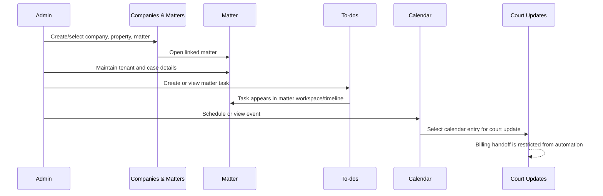

# Swimlanes

```mermaid
sequenceDiagram
  participant A as Admin
  participant CM as Companies & Matters
  participant M as Matter
  participant T as To-dos
  participant C as Calendar
  participant CU as Court Updates
  A->>CM: Create/select company, property, matter
  CM->>M: Open linked matter
  A->>M: Maintain tenant and case details
  A->>T: Create or view matter task
  T->>M: Task appears in matter workspace/timeline
  A->>C: Schedule or view event
  C->>CU: Select calendar entry for court update
  CU-->>CU: Billing handoff is restricted from automation
```

The diagram describes verified navigation and visible dependencies, not every save-side effect. `OBSERVED: RAD-E-0004 through RAD-E-0009`.
